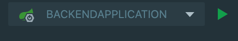
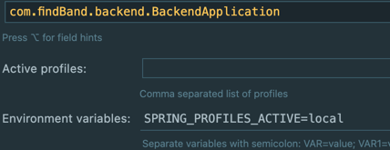

# findBand backend

Запуск приложения можно осуществить 2мя способами:

### Первый способ

1. Установить БД Postgres 13. https://www.postgresql.org/download/
2. Создать БД findband с кодировкой UTF-8
3. Установить redis. https://redis.io/docs/getting-started/
4. В src/main/resources добавить application-local.properties и заполнить следующие конфиги:

spring.datasource.url=<db_url>

spring.datasource.username=<db_user>

spring.datasource.password=<db_password>

jwt.base64-secret=<secret_word>

spring.redis.host=localhost

spring.redis.port=6379

spring.redis.password=

storage.folder=<storage_folder> (любую папку куда будут сохраняться загруженные аватарки пользователей)

5. Запустить redis командой redis-server
6. Запустить приложение из IDEA. Предварительно указать в конфигурации запуска в Environment Variables SPRING_PROFILES_ACTIVE=local

 

### Второй способ

Запуск приложения осуществляется через докер контейнеры

1. Установить docker desktop на компьютер https://docs.docker.com/get-docker/
2. Создаем файл .env в папке backend и заполняем его примерно так

   STORAGE_FOLDER=/home/uploads

   DB=jdbc:postgresql://findband_db:5432/findband

   DB_USERNAME=compose-postgres

   DB_PASSWORD=compose-postgres

   PROFILE=prod

   PATH_DOCKERFILE=./Dockerfile

   REDIS_PASSWORD=

   JWT_SECRET=<long_jwt_secret>
3. Из папки backend делаем _**mvn clean install**_.
4. Собираем из папки backend командой _**docker-compose build**_
5. Запускаем все командой _**docker-compose up**_